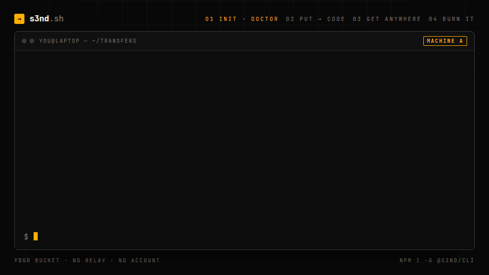

<p align="center">
  
</p>

# s3nd

**Send anything with a code, through your own bucket.**

[](https://github.com/AbderrahmaneMouzoune/s3nd/actions/workflows/ci.yml)
[](./packages/s3nd/LICENSE)
[](https://doc.s3nd.sh)

```sh
$ s3nd put ./report.pdf
report.pdf · 284 kB · expires in 1 day
K7QP2M4X

# any other machine
$ s3nd get k7qp-2m4x
Wrote /home/you/report.pdf · 284 kB
```

The bytes go from one machine to an S3 bucket you own, and from the bucket to the other machine.
Nothing streams through anyone else's server, nobody signs up for anything, and there is nothing
to deploy. Eight characters, forty bits, no I, L, O or U — read it over the phone, type it in the
wrong case with a dash in the middle, it still resolves. Works with AWS S3, Cloudflare R2, MinIO,
Scaleway, Wasabi and any S3-compatible storage.

The same primitive, inside your app: a local-first app's IndexedDB state carried to the user's next
device under a code, through your server, with your credentials never reaching a browser.

**[Website →](https://s3nd.sh)** · **[Documentation →](https://doc.s3nd.sh)** ·
**[Try the drop box →](https://drop.s3nd.sh)**

## First transfer in under two minutes

You need a bucket and a key pair that can read and write to it. Two ways to get one: Cloudflare R2's
free tier, or MinIO on your own machine without any cloud account.

### Cloudflare R2, on the free tier

R2's free plan comes with 10 GB of storage and charges nothing for egress, so moving a file between
two laptops costs nothing.

**1 · The bucket.** In the Cloudflare dashboard: **R2 → Create bucket**, named `transfers`. Leave
public access off; every read goes through your credentials. Or, with
[wrangler](https://developers.cloudflare.com/workers/wrangler/):

```sh
wrangler r2 bucket create transfers
```

**2 · The token.** **R2 → API → Manage API tokens → Create API token**, with **Object Read & Write**
on this bucket and nothing else. It hands back an access key id and a secret access key, once. Note
the account id too: it is the first part of the S3 endpoint R2 shows you,
`https://<account-id>.r2.cloudflarestorage.com`.

**3 · `s3nd init`.** It writes a configuration file that references the secrets instead of holding
them, then `doctor` performs every operation s3nd needs against the real bucket and reports what
happened:

```sh
npm install -g @s3nd/cli
s3nd init --provider r2 --bucket transfers

cat > .env <<'EOF'
R2_ACCOUNT_ID=…
R2_ACCESS_KEY_ID=…
R2_SECRET_ACCESS_KEY=…
EOF
echo .env >> .gitignore

s3nd doctor
```

```
✓ Configuration: bucket "transfers", region "auto", endpoint https://8c4….r2.cloudflarestorage.com
✓ Credentials: resolved, key ends in 1a2b
✓ Bucket reachable: HeadBucket succeeded
✓ Write, read, delete: round-tripped a probe object
! Expiry cleanup: no enabled expiration rule
  → Add an S3 lifecycle rule that expires objects under "transfers/" after a day or two.
```

That last line is worth acting on before the first real transfer: `expiresIn` stops a transfer being
_handed over_ after a day, but only a lifecycle rule deletes the object. In the dashboard,
**your bucket → Settings → Object lifecycle rules**, expire objects under the prefix `transfers/`
after two days. Run `s3nd doctor` again and it turns green.

Then send something. On the other machine, the same `s3nd.config.json` and `.env` are all it needs:

```sh
s3nd put ./report.pdf          # → K7QP2M4X
s3nd get K7QP2M4X              # on the other machine
s3nd rm K7QP2M4X               # burn it early; otherwise it expires on its own
```

The long version, with CI, profiles and what this setup trades away, is
[Without a server](https://doc.s3nd.sh/docs/no-server) in the documentation.

### MinIO on your machine, no cloud account

One container is an S3-compatible bucket on `localhost`:

```sh
docker run -p 9000:9000 -p 9001:9001 \
  -e MINIO_ROOT_USER=minioadmin -e MINIO_ROOT_PASSWORD=minioadmin \
  quay.io/minio/minio server /data --console-address ":9001"
```

Open the console on [localhost:9001](http://localhost:9001) (`minioadmin` / `minioadmin`) and create
a bucket named `transfers`. Then:

```sh
s3nd init --provider minio --bucket transfers   # localhost:9000, minioadmin — no .env to write
s3nd doctor
s3nd put ./report.pdf
```

Nothing leaves your machine. The same container is what an integration test points at, and a
`local` profile in `s3nd.config.json` lets one file hold both setups:

```json
{
  "envFile": ".env",
  "profiles": {
    "r2": { "bucket": "transfers", "region": "auto", "endpoint": "https://${R2_ACCOUNT_ID}.r2.cloudflarestorage.com" },
    "local": { "bucket": "transfers", "endpoint": "http://localhost:9000" }
  }
}
```

```sh
s3nd -p local doctor
s3nd -p r2 put ./report.pdf
```

## Three ways in

**From a terminal** — `@s3nd/cli`. Straight to the bucket with the credentials on that machine, or
through your own server with `--remote` and a token. The code goes to stdout and everything else to
stderr, so it composes: `CODE=$(s3nd put ./report.pdf)`, and `tar cz ./project | s3nd put - --name project.tar.gz`
moves a directory. [Every command →](https://doc.s3nd.sh/docs/cli)

**Inside your app** — `s3nd` on the server, `@s3nd/react` in the browser. One route file turns any
bucket into a drop box; the hooks send a file or a snapshot and read a code back, with typos repaired
as the user types. [The library →](https://s3nd.sh/library) · [The hooks →](https://s3nd.sh/react)

```ts
// app/api/transfers/[[...route]]/route.ts
import { createBucket, createTransferHandler } from 's3nd'

export const { GET, POST, DELETE } = createTransferHandler({
  bucket: createBucket({ bucket: 'drop' }),
  expiresIn: 24 * 3600,
  authorize: (request) => request.headers.get('authorization') === `Bearer ${process.env.TOKEN}`,
})
```

**Anything that speaks HTTP** — `@s3nd/protocol`. Four routes, one error format, a typed client
that bundles for a browser because it carries no storage client. `curl` works.
[The protocol →](https://doc.s3nd.sh/docs/protocol)

## Not only files. An app's whole state.

Your app keeps everything in IndexedDB: fast, offline, private. Then the user opens it on their
phone and it is empty, because IndexedDB does not leave the browser it was written in. A snapshot
is a self-describing, gzipped envelope around that state, stored under a code the user carries to the
next device.

```ts
import { createBucket } from 's3nd'

const store = createBucket({ bucket: 'my-bucket', prefix: 'snapshots' })

// On the old device: hand the user a code.
const code = store.codes.create() // "K7QP2M4X"
await store.putSnapshot(code, state, { app: 'notes', version: 3, expiresIn: 3600 })

// On the new device: they type it in.
const snapshot = await store.getSnapshot(store.codes.normalize(typed), { maxVersion: 3 })
snapshot?.data // → the state, ready to write back into IndexedDB
```

Credentials stay on your server — the browser only ever talks to your own API, so there is no CORS
policy to write on the bucket and nothing to sign client-side. `maxVersion` refuses a snapshot written
by a newer schema, and a conditional write keeps two devices from claiming the same code.

**[Move to a new device →](https://doc.s3nd.sh/docs/use-cases/new-device)** ·
**[Run the IndexedDB example →](./examples/indexeddb-sync)**

## This repository

A bun workspace monorepo, driven by Turborepo.

| Path                                                   | What it is                                                                                                               |
| ------------------------------------------------------ | ------------------------------------------------------------------------------------------------------------------------ |
| [`packages/protocol`](./packages/protocol)             | `@s3nd/protocol` — the wire contract, a client, sync codes. No storage client, so it bundles for a browser.              |
| [`packages/s3nd`](./packages/s3nd)                     | `s3nd` — the S3 primitive: snapshots, files, the handler.                                                                |
| [`packages/react`](./packages/react)                   | `@s3nd/react` — hooks. Depends on the protocol, never on S3.                                                             |
| [`packages/cli`](./packages/cli)                       | `@s3nd/cli` — the `s3nd` binary, built on the primitive.                                                                 |
| [`apps/docs`](./apps/docs)                             | The documentation site — guides, use cases, API reference. Served from doc.s3nd.sh.                                      |
| [`apps/website`](./apps/website)                       | The marketing site at s3nd.sh — what it is, the three ways in, use cases, providers, comparisons.                        |
| [`examples/indexeddb-sync`](./examples/indexeddb-sync) | A notes app in IndexedDB, moved between devices with a code.                                                             |
| [`examples/node-script`](./examples/node-script)       | Snapshot round-trip, expiry and conflicts in one file.                                                                   |
| [`templates/drop`](./templates/drop)                   | A small WeTransfer on your own bucket, live at drop.s3nd.sh: the one-click Vercel template, on `s3nd` and `@s3nd/react`. |

The split follows one constraint: a browser must never end up with a storage client in its
dependency tree. `@s3nd/protocol` is what both halves share, which is why it exists at all
rather than living inside `s3nd`.

```
@s3nd/protocol   nanoid                      the contract, shared by everything
s3nd             + aws-sdk, protocol         the S3 primitive
@s3nd/react      + protocol, react (peer)    hooks — no path to S3
@s3nd/cli        + s3nd                      the binary
```

## Working on it

A [bun](https://bun.com) workspace, with [Turborepo](https://turborepo.dev) running the tasks.

```sh
bun install
bun run build        # turbo build across the workspace
bun run test         # the package's test suite
bun run type-check
bun run lint
bun run format
```

Run the docs site locally with `bun run --filter @s3nd/docs dev` — it listens on
[localhost:3100](http://localhost:3100). The website is `bun run --filter @s3nd/website dev`, on
[localhost:3300](http://localhost:3300), and the drop template is `bun run --filter s3nd-drop dev`, on
[localhost:3400](http://localhost:3400).

The template depends on `s3nd@^0.1.0` and `@s3nd/react@^0.1.0` rather than on `workspace:*`, on
purpose: bun links the workspace packages while the version matches, so it builds here against the
local source, and the same `package.json` installs from npm once it is cloned on its own, which is
what the Vercel deploy button does.

bun installs and orchestrates; the toolchain itself still runs on Node. That is deliberate rather
than half-finished: `s3nd` is published for Node, so the test suite runs on Node — CI runs it
on 20, 22 and 24 — and `.bin/vitest` carries a `#!/usr/bin/env node` shebang, so it picks up
whichever version is on `PATH`. Switching the runner to `bun test` would trade that coverage for a
second or two of wall clock.

The test suite is offline: it runs against an in-memory stand-in for S3 that honours the
conditional headers, so snapshots genuinely round-trip without credentials or network. For an
integration check against the real protocol, point an example at
[the MinIO container above](#minio-on-your-machine-no-cloud-account).

The demo at the top of this page is the CLI's real output for that journey, replayed in
`.github/demo.gif`.

## Releasing

Releases are driven by [release-please](https://github.com/googleapis/release-please) and by the
commit messages that land on `main`, which follow
[Conventional Commits](https://www.conventionalcommits.org/). Pull requests are squash-merged, so
the pull request title is the message that counts — CI checks its shape on every pull request.

| A commit on `main`                         | Takes 0.1.0 to                         |
| ------------------------------------------ | -------------------------------------- |
| `fix: …`                                   | 0.1.1                                  |
| `feat: …`                                  | 0.2.0                                  |
| `feat!: …`, or a `BREAKING CHANGE:` footer | 0.2.0 — the major bump waits for 1.0.0 |
| `chore: …`, `ci: …`, `docs: …`, `test: …`  | nowhere, no release                    |

Only commits touching `packages/s3nd` release it; the docs site, the examples and the
workflows do not.

While there is something to release, the [release workflow](./.github/workflows/release.yml) keeps
a `chore: release x.y.z` pull request open, carrying the version bump and the entry it would add to
[the changelog](./packages/s3nd/CHANGELOG.md). Merging it is the release: the commit is
tagged `vx.y.z`, the GitHub release is created from that changelog entry, and the package is
published to npm with provenance.

[`release-please-config.json`](./release-please-config.json) holds the settings;
[`.release-please-manifest.json`](./.release-please-manifest.json) holds the last released version
and is rewritten by release-please, so leave it alone.

Two repository secrets:

- `NPM_TOKEN`, with publish rights. If you would rather use npm trusted publishing, configure this
  repository as a trusted publisher on npm and drop the `NODE_AUTH_TOKEN` line from the workflow —
  the `id-token: write` permission it already grants is what OIDC needs.
- `RELEASE_PLEASE_TOKEN`, optional: a personal access token with `contents` and `pull-requests`
  write access. GitHub skips workflows on pull requests opened with the default `GITHUB_TOKEN`, so
  without it the release pull request shows no checks.

Running the workflow by hand with **Publish** ticked publishes the version currently on `main` —
the way out when a release was tagged but the publish step failed.

## License

MIT © Abderrahmane Mouzoune
